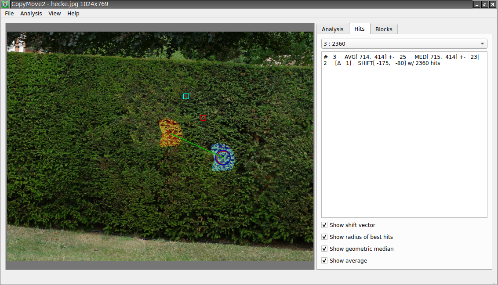

# CopyMove2

CopyMove2 is a rewrite of [copymove](https://sites.google.com/site/elsamuko/forensics/clone-detection), a cli version and GIMP plugin of [JGC's implementation](http://www.jgc.org/blog/2008/02/tonight-im-going-to-write-myself-aston.html) of [Fridrich's paper](http://www.ws.binghamton.edu/fridrich/Research/copymove.pdf).

The idea behind all these, is to split up the image in square blocks, [DCT](https://en.wikipedia.org/wiki/Discrete_cosine_transform) them, and use some of the DCT frequencies as a characteristic vector for this block. Then you can sort and compare these vectors and calculate shift vectors over the image.

# Screenshot

## Features
### Multiplatform
Thanks to C++, Qt and ImageMagick CopyMove2 runs on Linux, Mac and Windows.

### Performance
Compared to the original copymove, CopyMove2 has some huge performance and memory usage improvements, though the algorithm still needs a lot of resources. Parts of the algorithm scale well because it uses all cores of your computer.

### Usability
CopyMove2 comes with a GUI version, which eases inspection of suspicious images. You can export screenshots or data of found shift vectors.

## Building
You need your systems build environment (Linux: GCC, Mac: brew, Xcode, Windows: VS2015), [Qt](https://www.qt.io/download) and bash.

### GUI version
Open [qcopymove2.pro](https://github.com/elsamuko/copymove2/blob/master/build/qmake/qcopymove2.pro) and build with Qt Creator.

### CLI version
Before building, you need a static build of ImageMagick. Just run the build_imagemagick_linux/mac/win.sh in the scripts folder, they deploy ImageMagick to the libs folder automatically.
The static build is dependent on some imaging libraries (libjpeg, libpng, ...), which can be resolved with
Mac: brew install libtiff libjpeg
Linux: sudo apt-get build-dep imagemagick
Windows: All deps are included in the imagemagick distribution

Then you can open and build [copymove2.pro](https://github.com/elsamuko/copymove2/blob/master/build/qmake/copymove2.pro) with Qt Creator.

## TODO
The current state finds a lot of false positives, and the output of the CLI version is not yet very processing friendly, e.g. for use in pipes.
